# AOP

## 什么是AOP

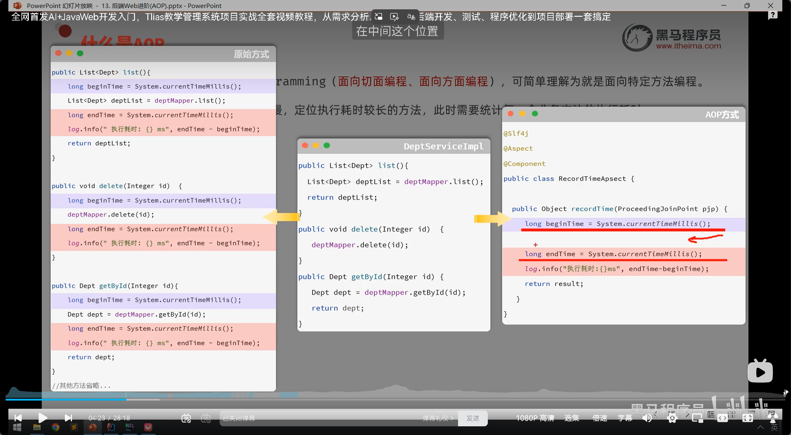

## AOP快速入门

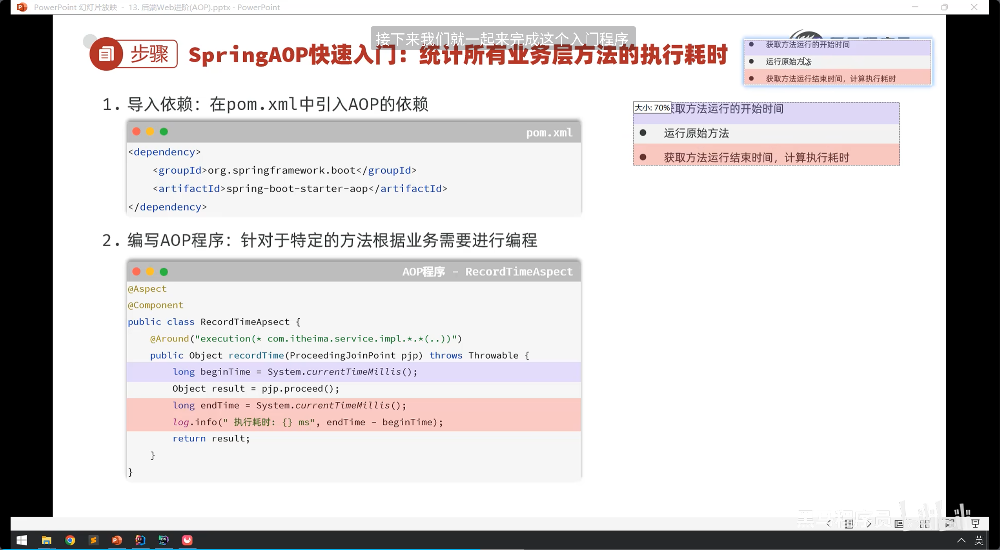

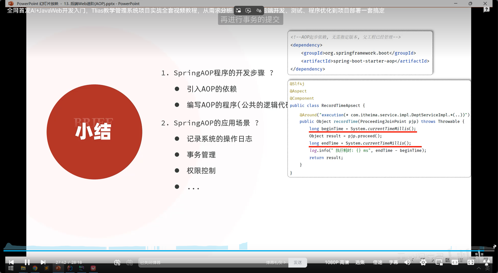

## AOP核心概念

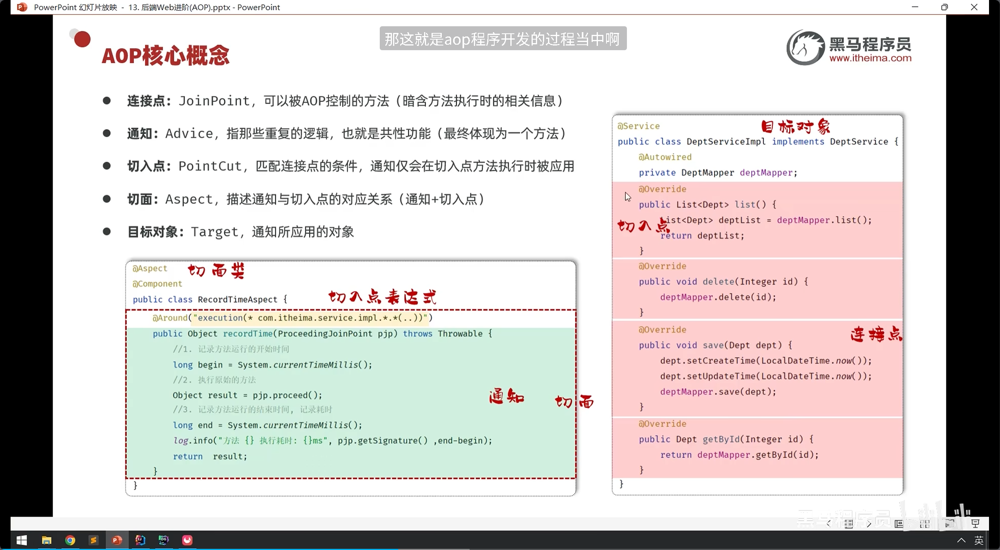

### 常见的通知类型：

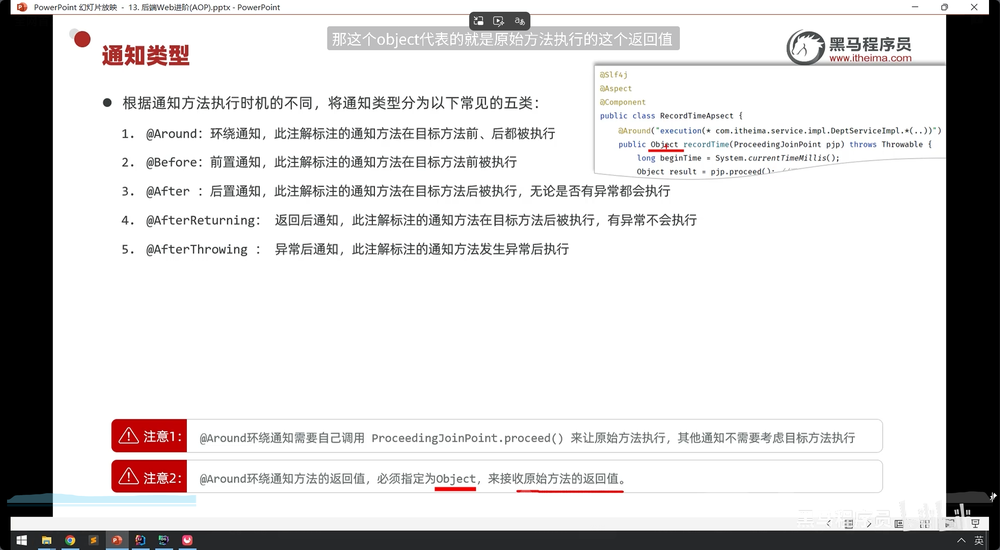

切入点表达式

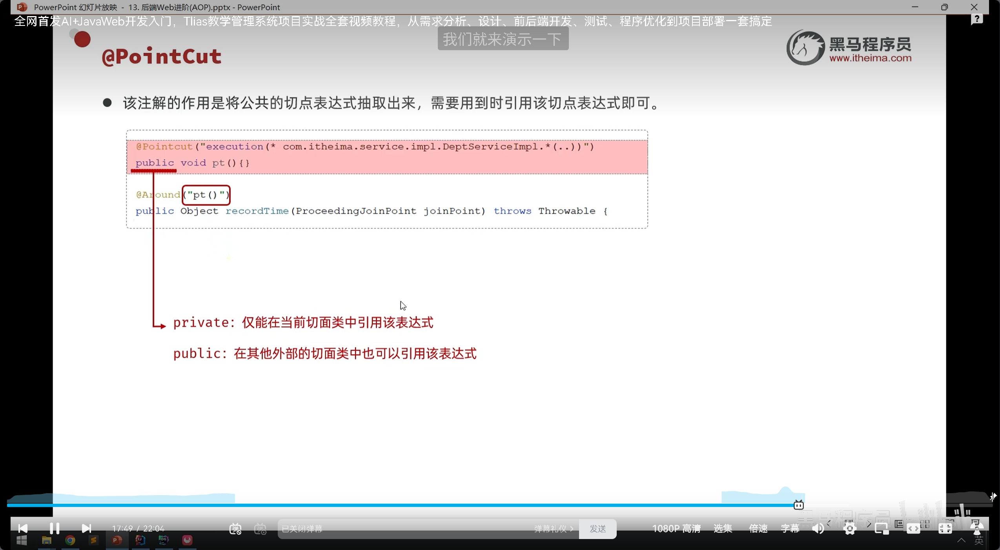

#### 切入点方法

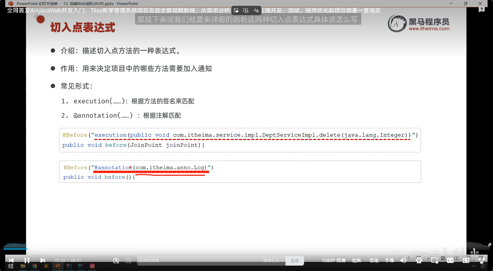

#####  1.（优先使用）

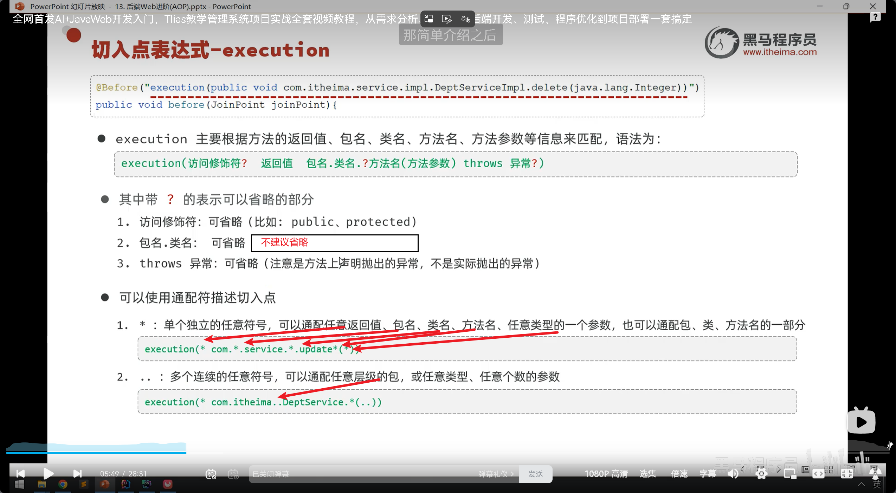

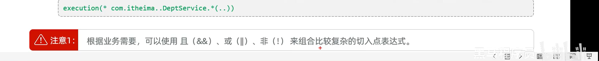

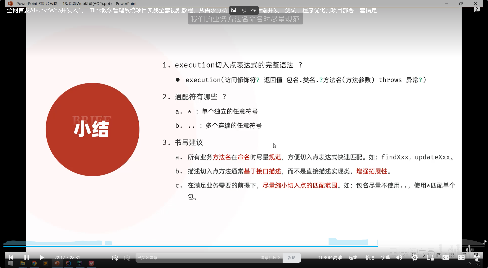

#####  2.

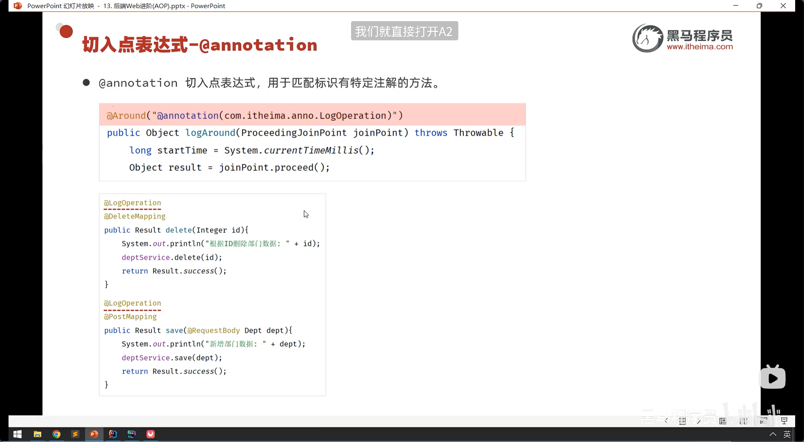

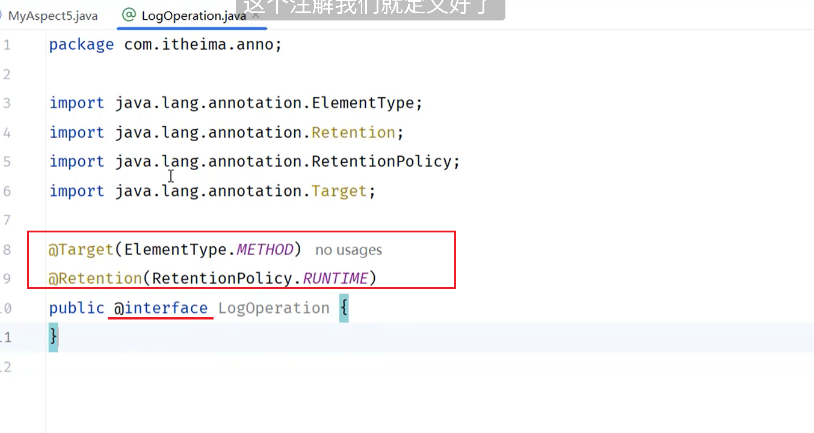

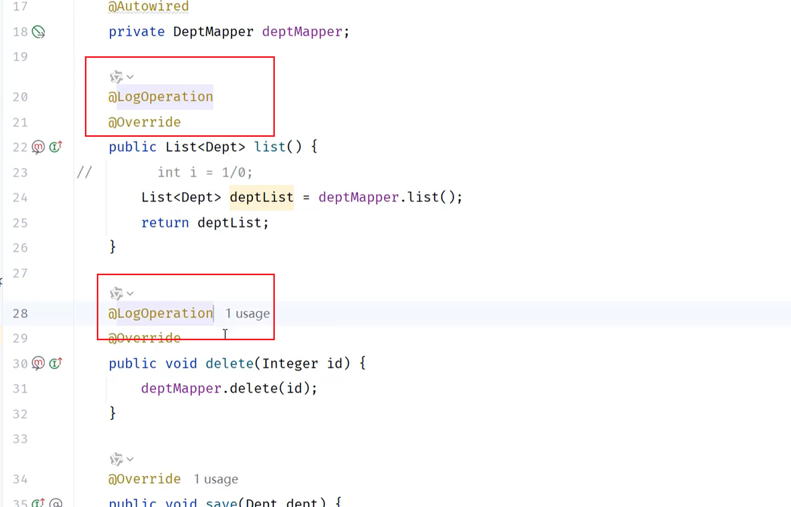

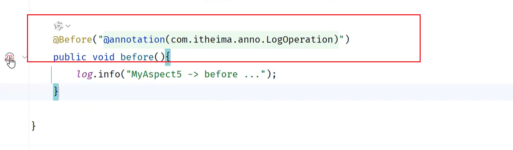

### 通知顺序

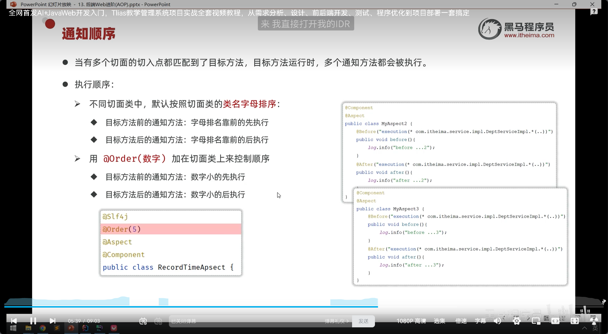

### 连接点

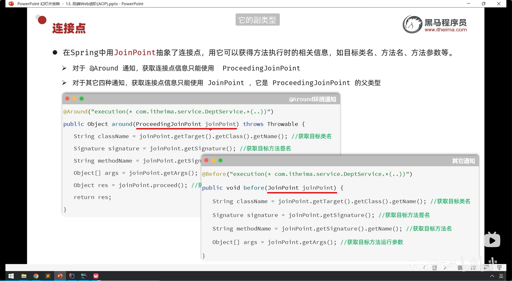

#### 获取连接点信息的方法（除了Around）

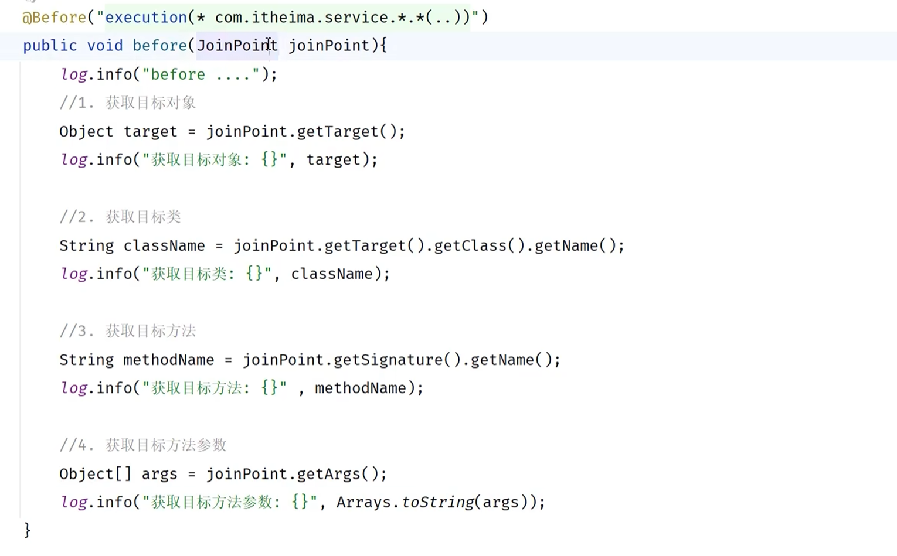

#### Around

用一个子类，方法其实一致

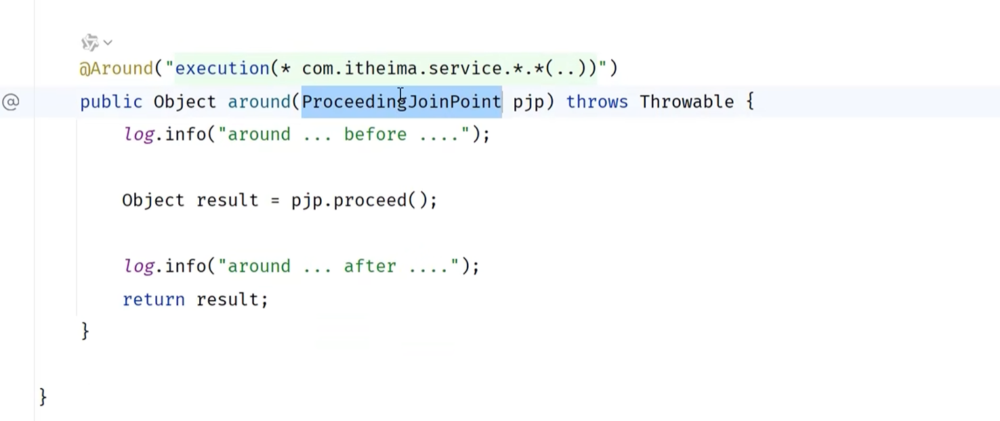

## AOP执行流程

底层是动态代理

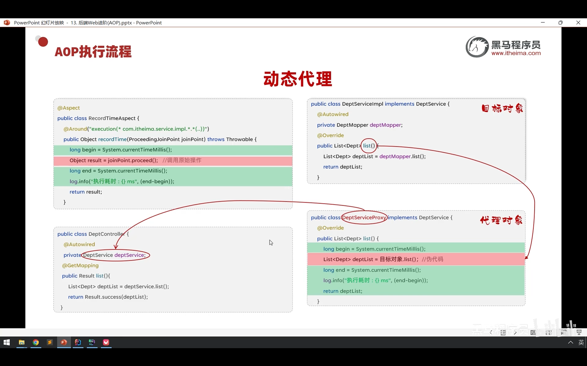