# SpringBoot

## SpringBoot配置优先级

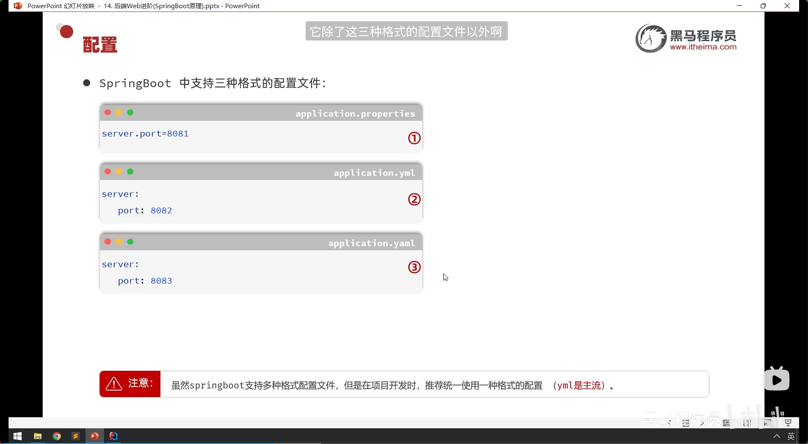

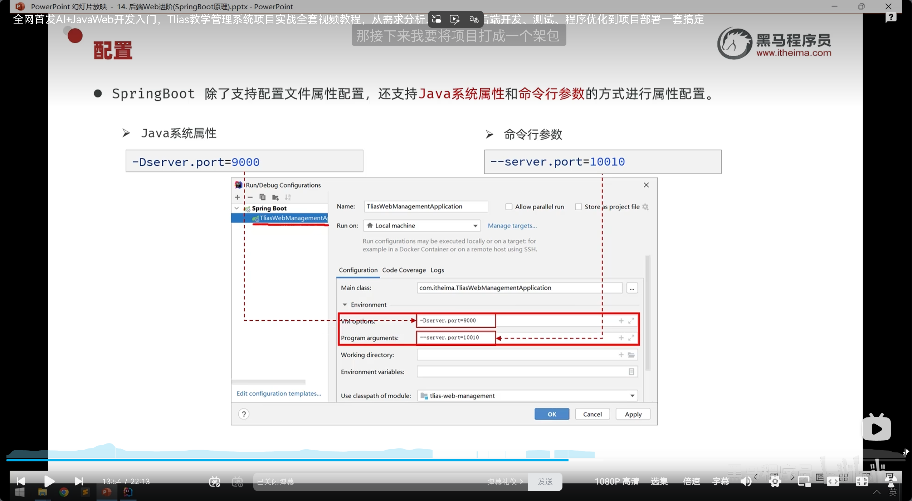

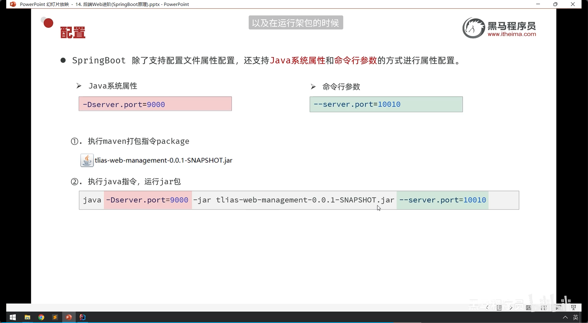

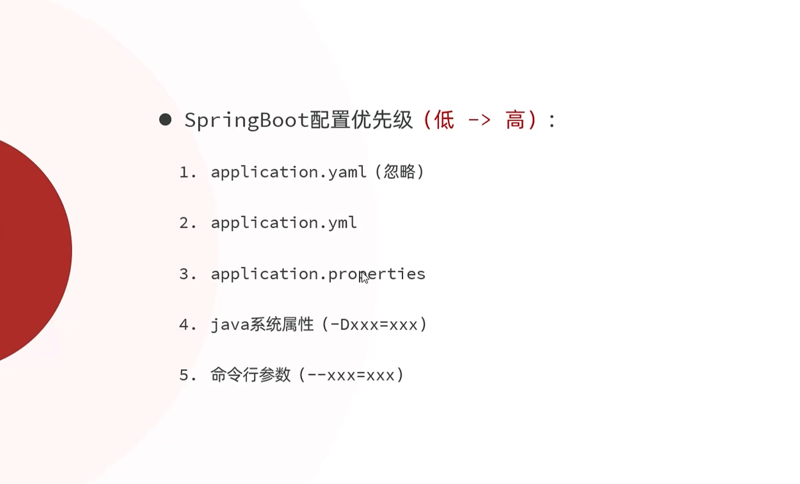

## SpringBoot的Bean管理

### Bean的作用域

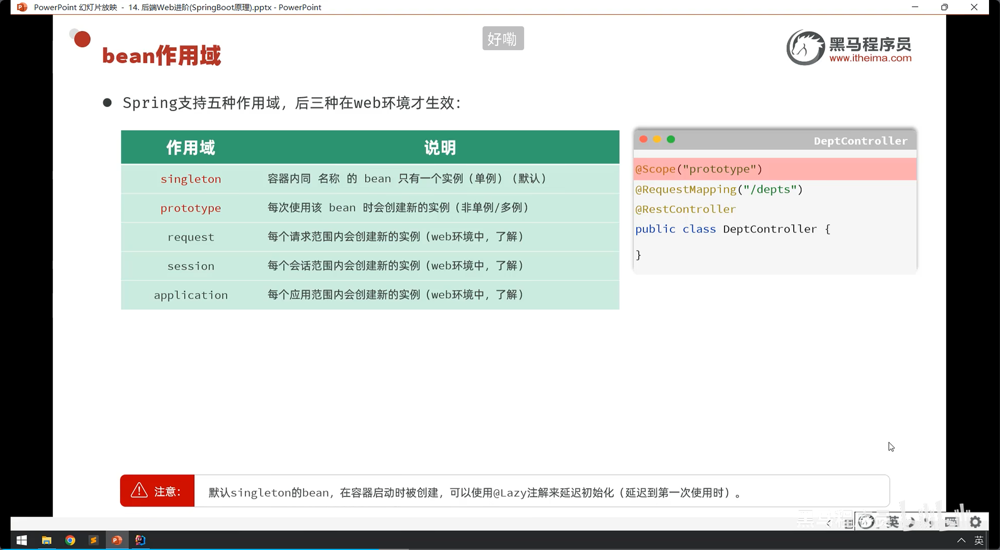

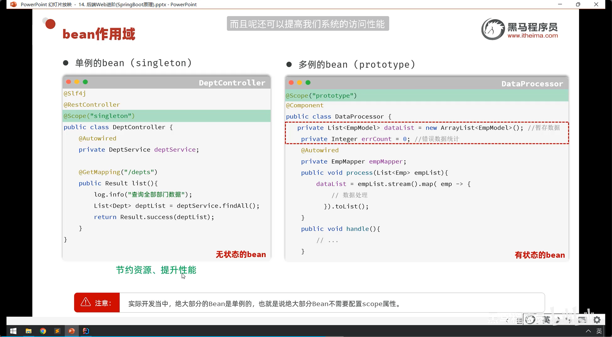

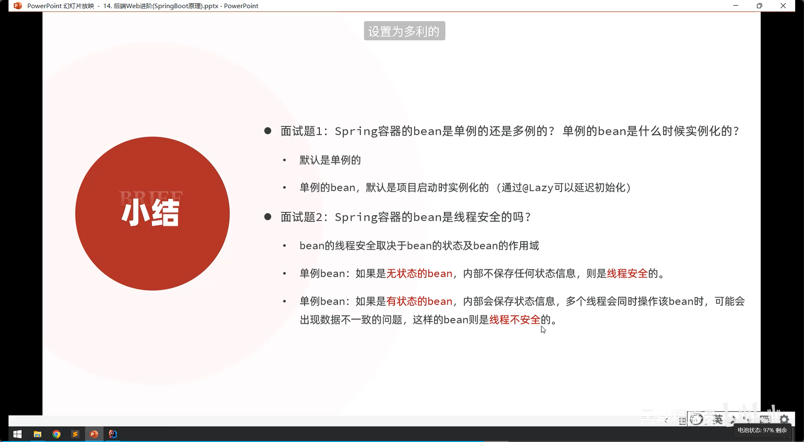

### 第三方Bean

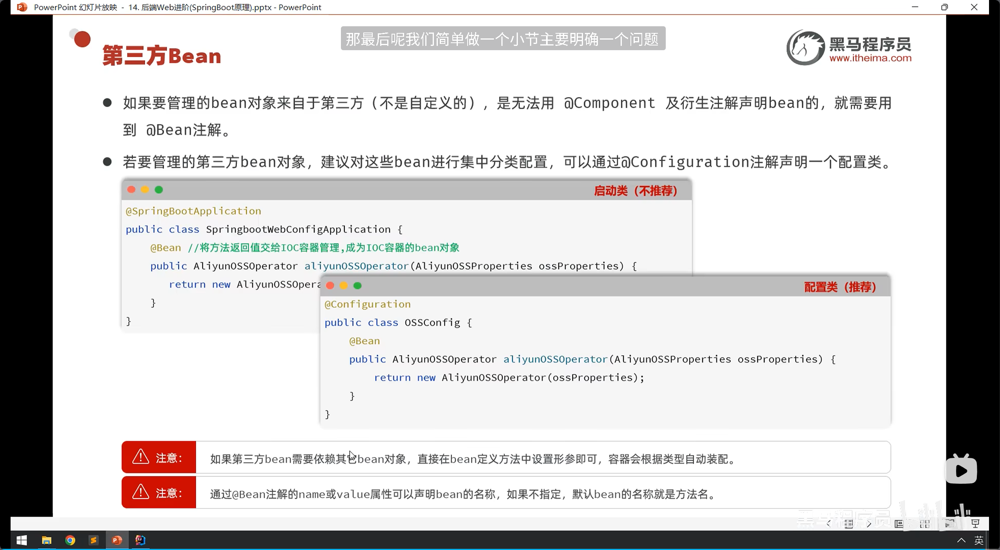

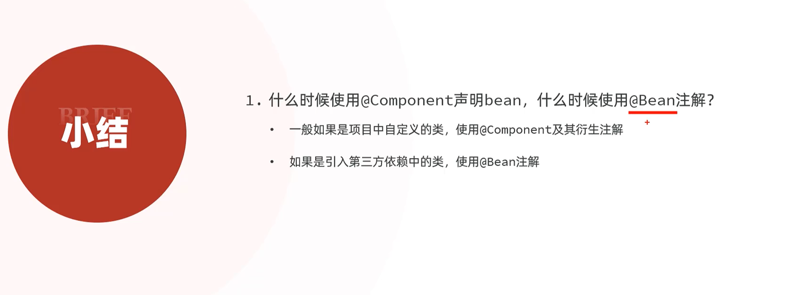

# SpringBoot的原理

## 依赖原理

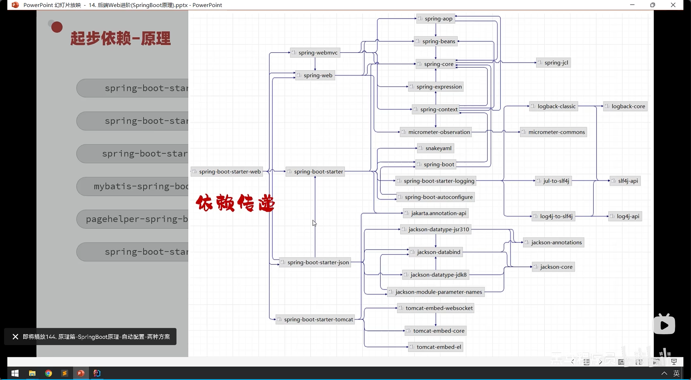

## 自动配置

### 什么是自动配置：

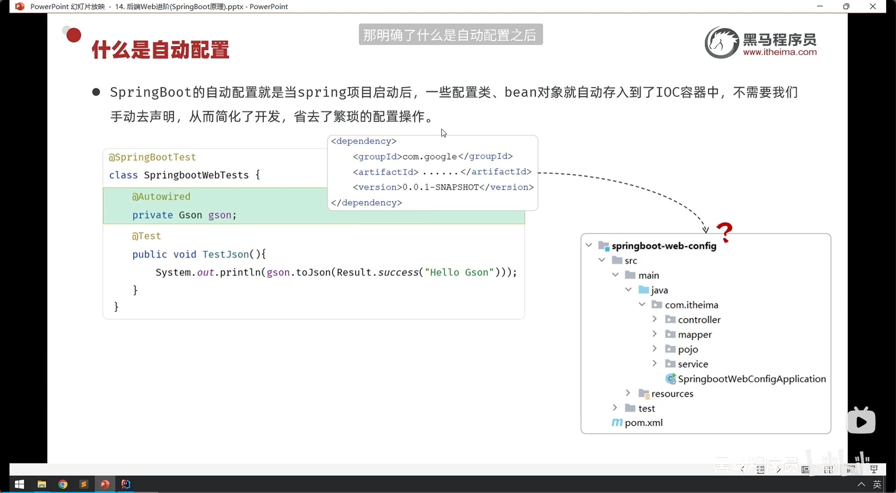

#### 自动配置方案一：

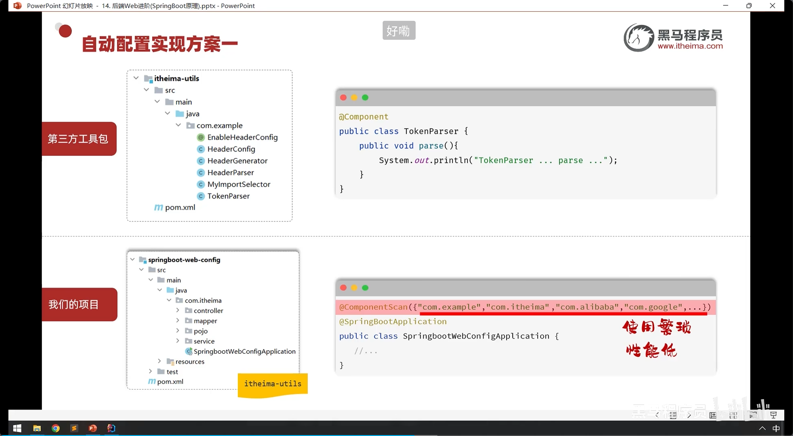

#### 自动配置方案二：

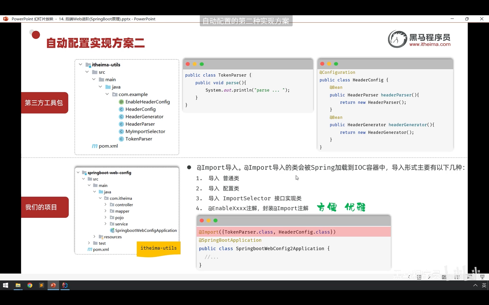

### 小结：

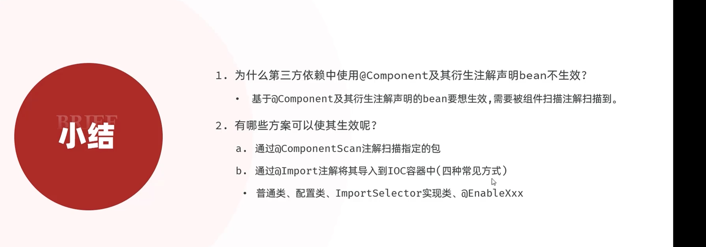

## 源码跟踪

这块自己看看试试

### 自动配置注解

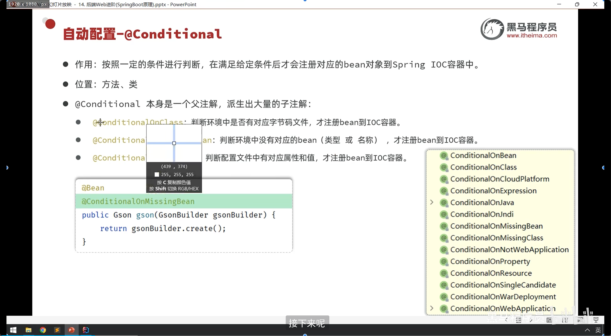

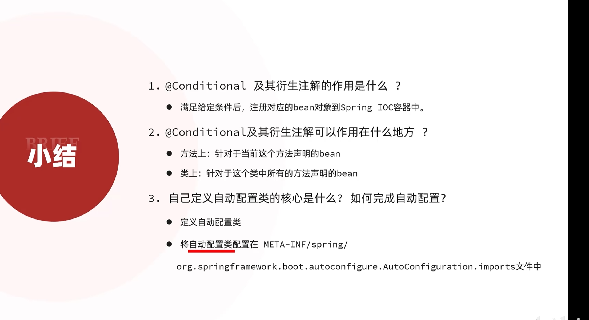

### 自动配置-starter，回头再看
