# 多表关系

##  概述：

### 1.一对多（多对一）

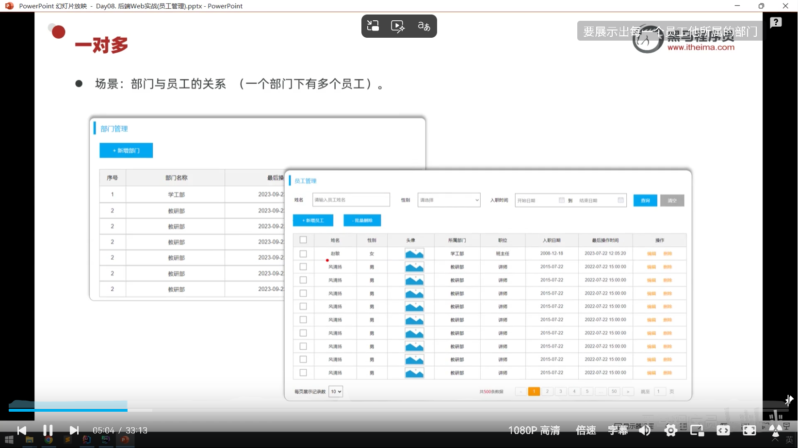

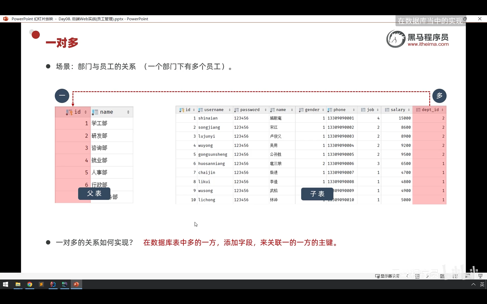

#### 问题和解决

##### 问题：

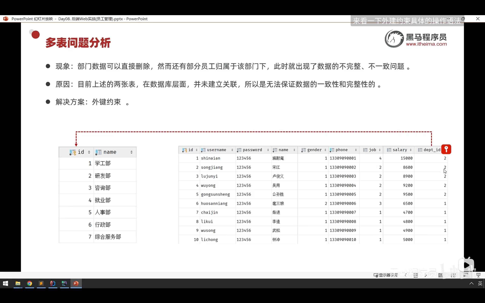

##### 解决

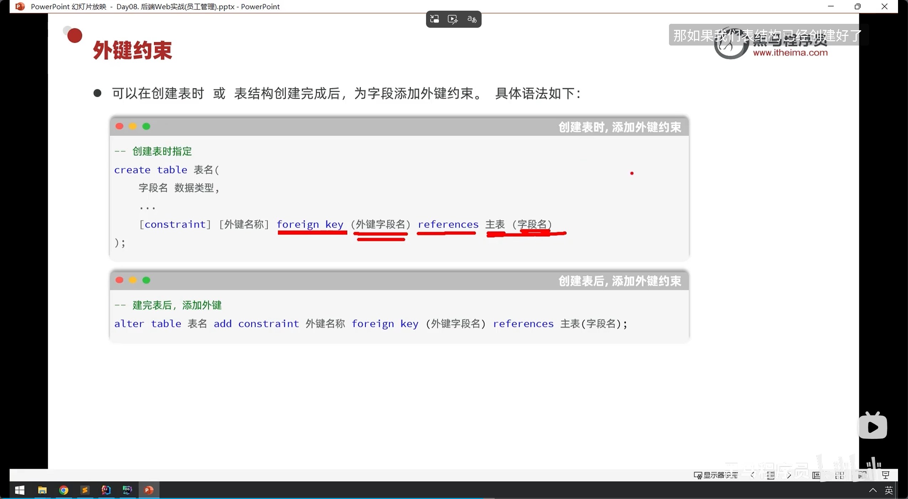

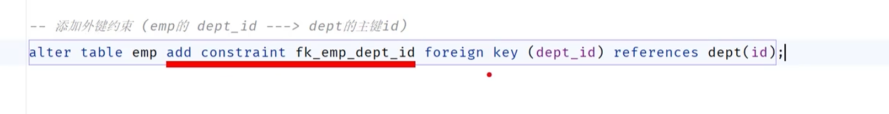

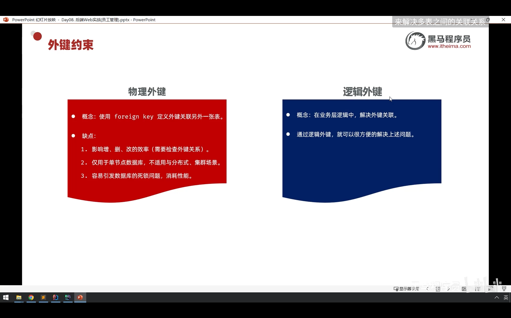

### 2.一对一

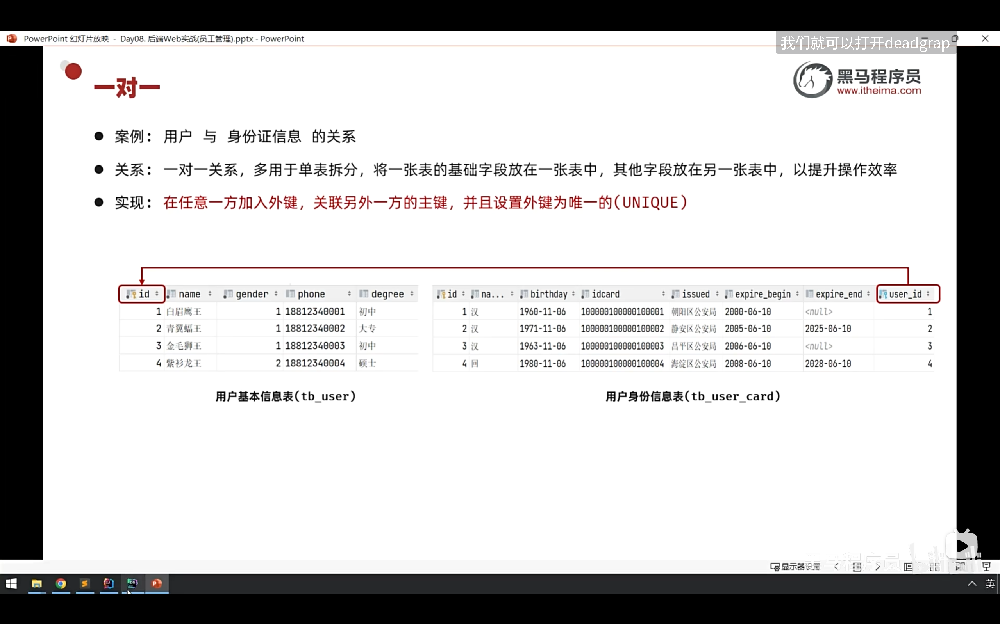

### 3.多对多

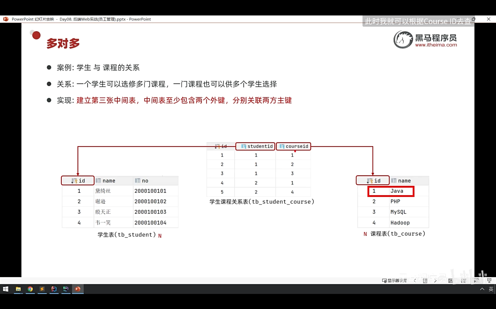

# 多表查询

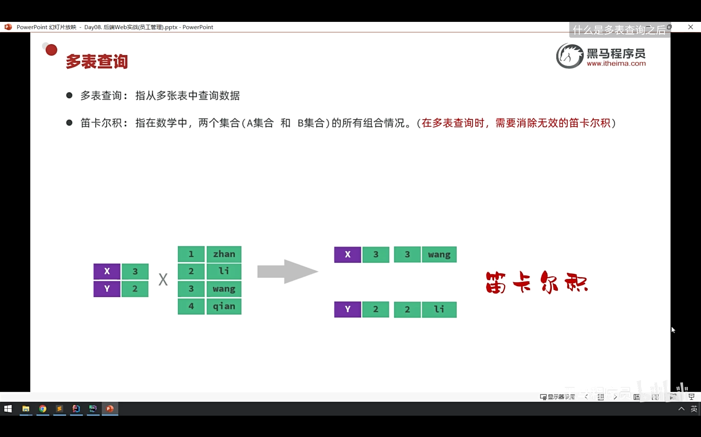

## 多表查询的分类

### 1.内连接

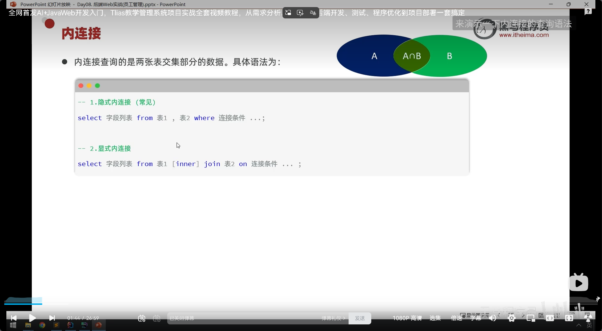

#### 示例

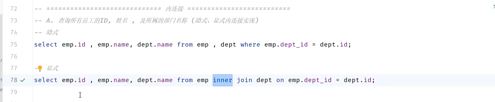

inner关键字可以省略

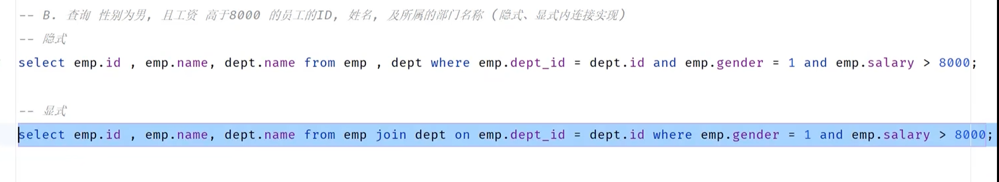

用了别名，语句内表名称要全部改为别名

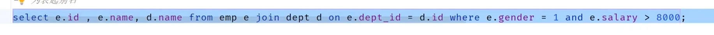

### 2.外连接

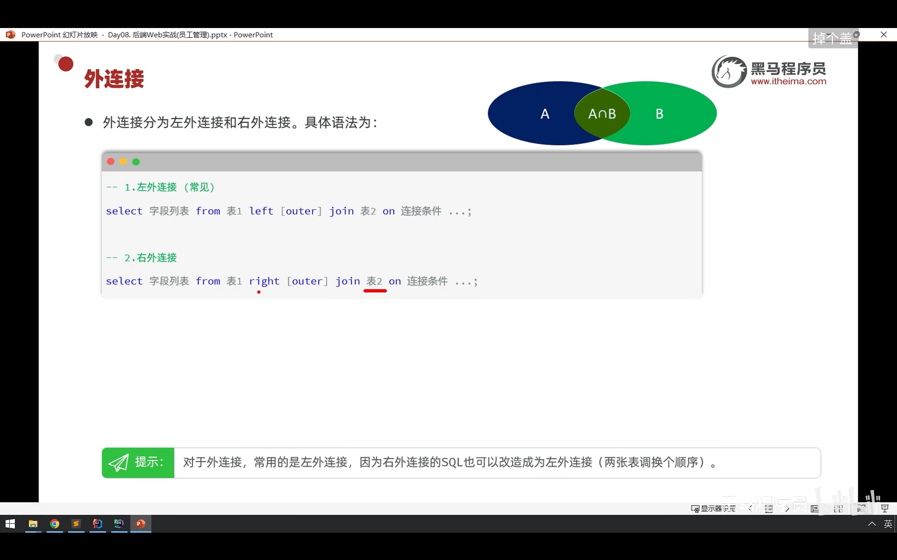

#### 示例

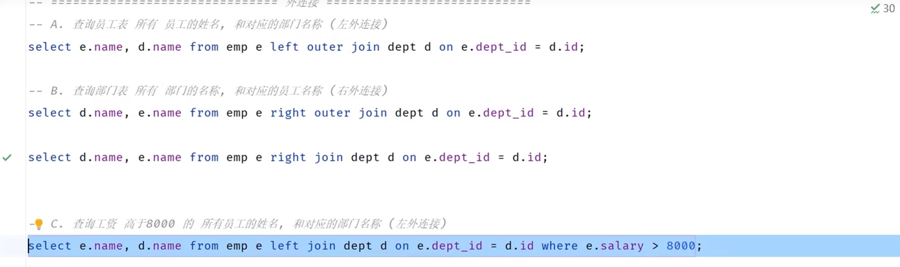

### 3.子查询

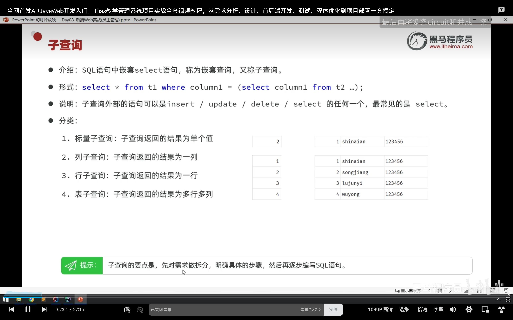

#### 标量子查询示例

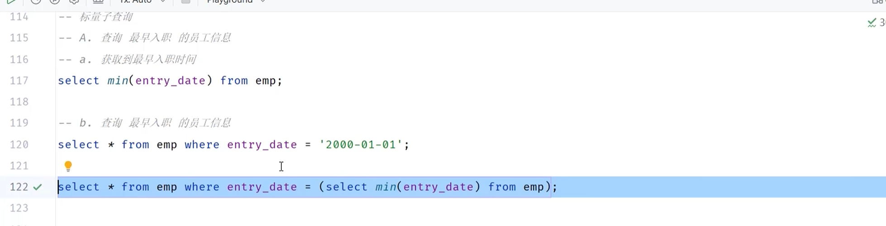

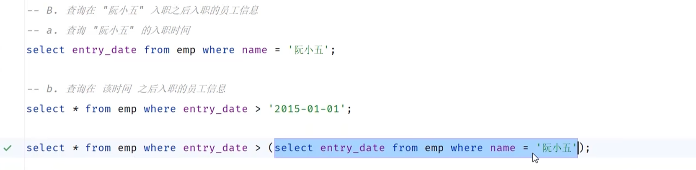

#### 列子查询示例

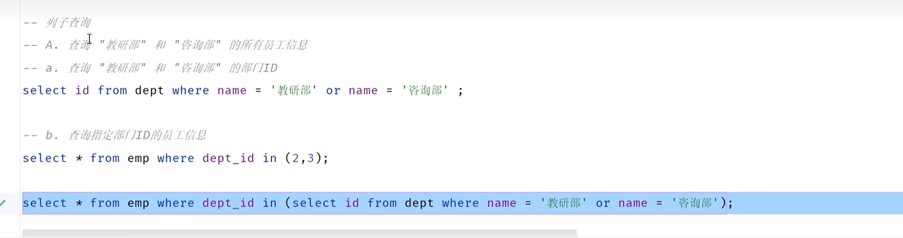

#### 行子查询

#### 表子查询

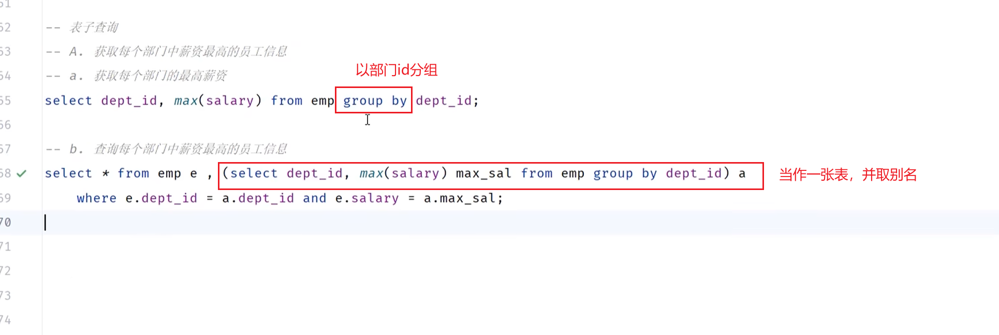