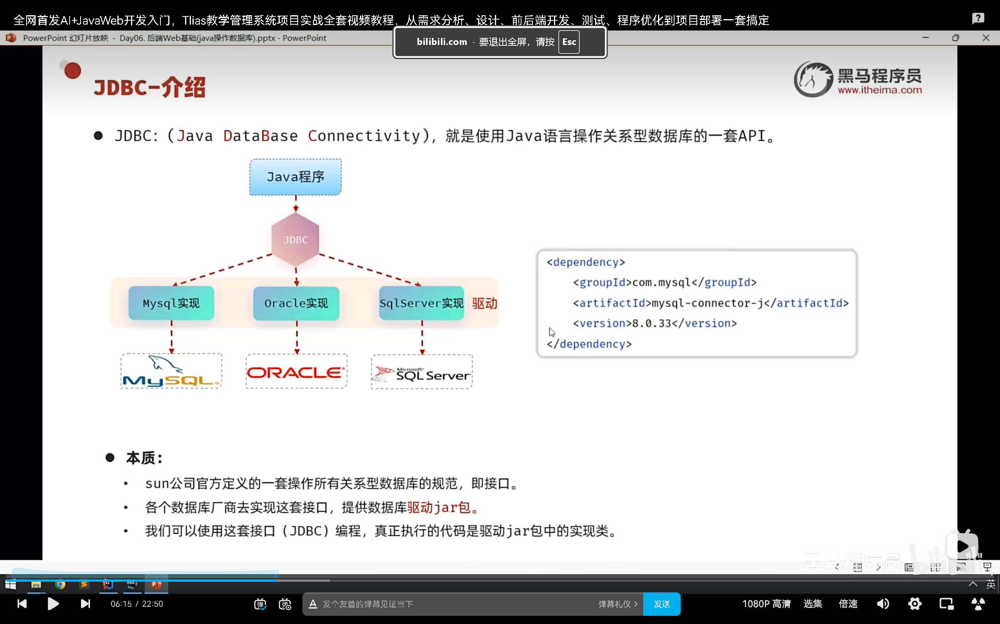
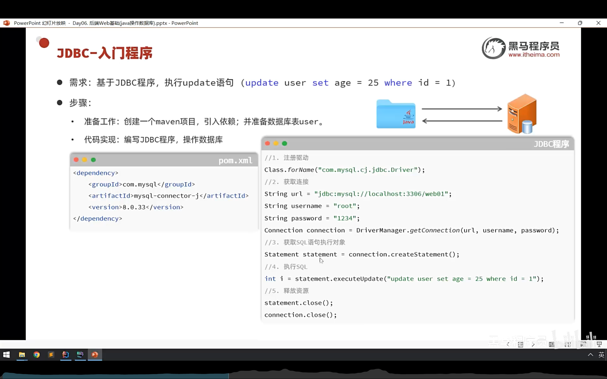
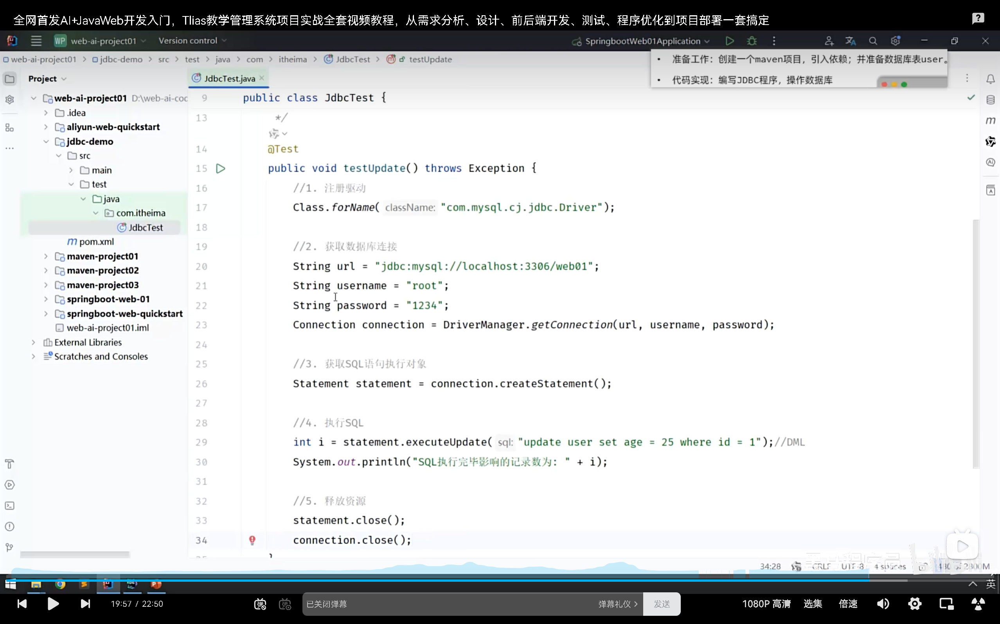
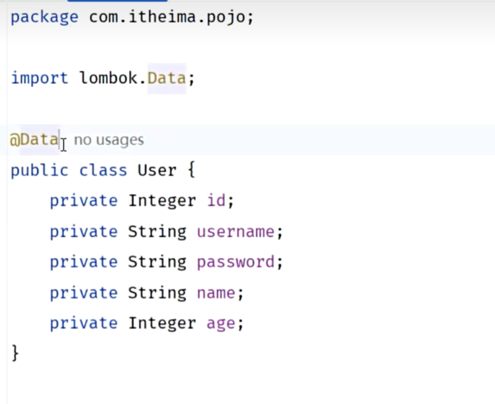
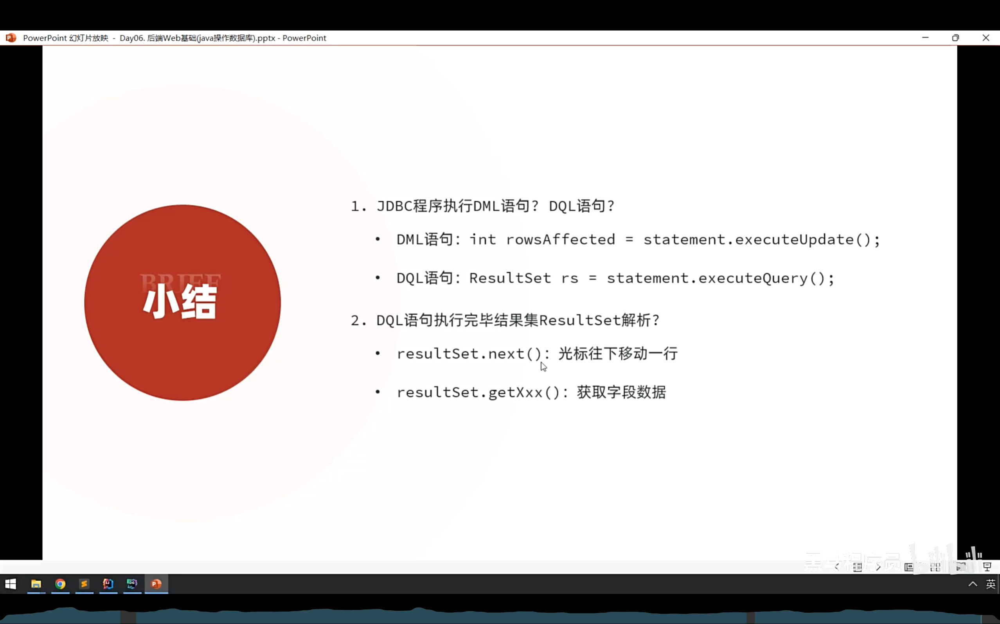
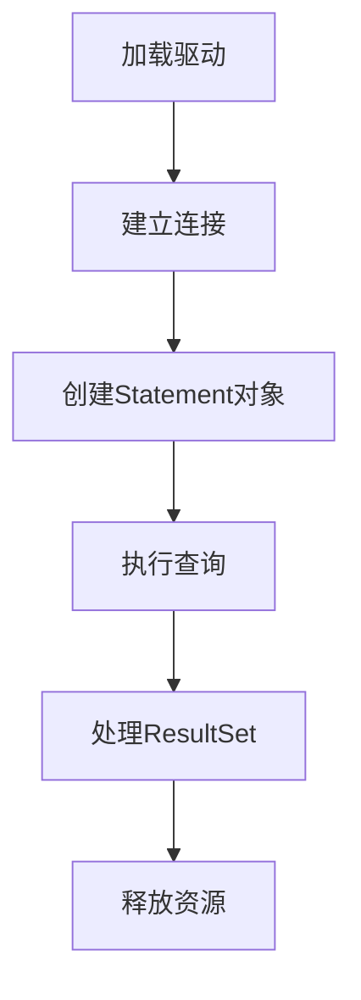
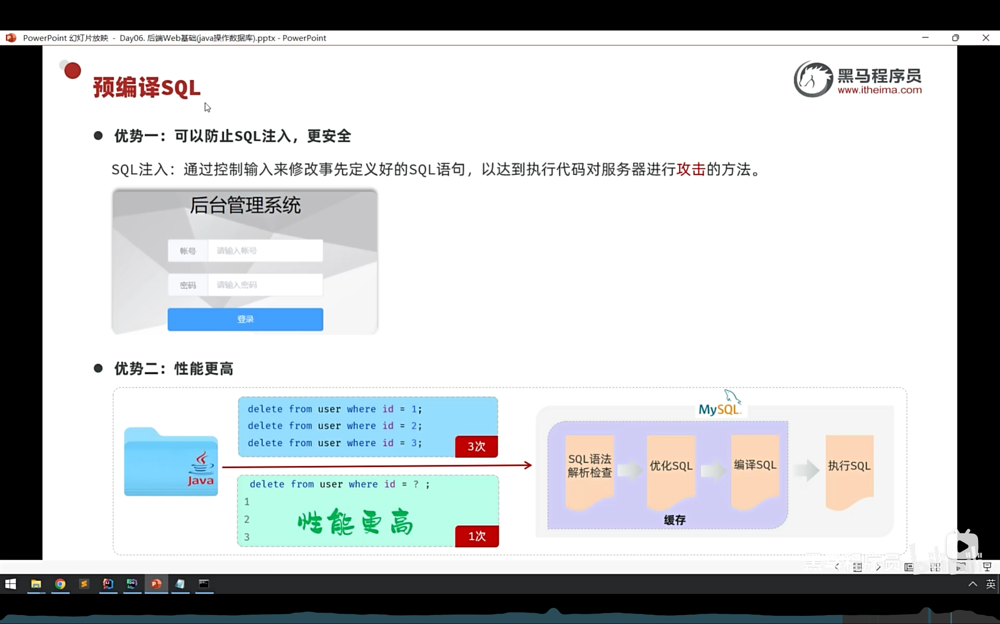

# JDBC

## 什么是JDBC



## JDBC的流程





## DATA注解的妙用



# JDBC执行DQL语句



我来帮你清晰梳理 JDBC 执行 DQL（Data Query Language）语句的完整过程：

## 一、JDBC 执行 DQL 的核心流程



## 二、详细步骤解析

### **步骤1：加载数据库驱动**
```java
// 传统方式（JDBC 4.0之前需要显式加载）
Class.forName("com.mysql.cj.jdbc.Driver");

// JDBC 4.0+ 自动通过 SPI 加载，可以省略此步骤
```

### **步骤2：建立数据库连接**
```java
String url = "jdbc:mysql://localhost:3306/test?useSSL=false&serverTimezone=UTC";
String username = "root";
String password = "123456";

Connection connection = DriverManager.getConnection(url, username, password);
```

### **步骤3：创建 Statement 对象**
有三种方式：
```java
// 1. Statement - 普通语句对象（可能有SQL注入风险）
Statement stmt = connection.createStatement();

// 2. PreparedStatement - 预编译语句（推荐，防SQL注入）
String sql = "SELECT * FROM users WHERE age > ? AND name LIKE ?";
PreparedStatement pstmt = connection.prepareStatement(sql);
pstmt.setInt(1, 18);
pstmt.setString(2, "张%");

// 3. CallableStatement - 用于存储过程
```

### **步骤4：执行查询并获取结果集**
```java
// 执行查询，返回 ResultSet 对象
ResultSet rs = pstmt.executeQuery();  // 对于PreparedStatement

// 或者使用 Statement
// ResultSet rs = stmt.executeQuery("SELECT * FROM users");
```

### **步骤5：处理 ResultSet 结果集**
```java
while (rs.next()) {  // 遍历每一行数据
    // 按列名获取数据（推荐）
    int id = rs.getInt("id");
    String name = rs.getString("name");
    int age = rs.getInt("age");
    Date createTime = rs.getDate("create_time");
    
    // 或按索引获取（索引从1开始）
    // int id = rs.getInt(1);
    
    // 处理数据...
    System.out.printf("ID: %d, Name: %s, Age: %d%n", id, name, age);
}
```

### **步骤6：释放资源（重要！）**
```java
// 关闭顺序：ResultSet → Statement → Connection
if (rs != null) {
    try { rs.close(); } catch (SQLException e) { e.printStackTrace(); }
}
if (pstmt != null) {
    try { pstmt.close(); } catch (SQLException e) { e.printStackTrace(); }
}
if (connection != null) {
    try { connection.close(); } catch (SQLException e) { e.printStackTrace(); }
}
```

## 三、完整示例代码

```java
import java.sql.*;

public class JdbcDQLExample {
    public static void main(String[] args) {
        Connection conn = null;
        PreparedStatement pstmt = null;
        ResultSet rs = null;
        
        try {
            // 1. 建立连接
            conn = DriverManager.getConnection(
                "jdbc:mysql://localhost:3306/test",
                "root",
                "password"
            );
            
            // 2. 创建预编译语句
            String sql = "SELECT id, name, email, salary FROM employees WHERE department = ?";
            pstmt = conn.prepareStatement(sql);
            pstmt.setString(1, "IT");
            
            // 3. 执行查询
            rs = pstmt.executeQuery();
            
            // 4. 处理结果集
            System.out.println("ID\tName\tEmail\t\tSalary");
            System.out.println("----------------------------------------");
            while (rs.next()) {
                int id = rs.getInt("id");
                String name = rs.getString("name");
                String email = rs.getString("email");
                double salary = rs.getDouble("salary");
                
                System.out.printf("%d\t%s\t%s\t%.2f%n", id, name, email, salary);
            }
            
        } catch (SQLException e) {
            e.printStackTrace();
        } finally {
            // 5. 释放资源
            try {
                if (rs != null) rs.close();
                if (pstmt != null) pstmt.close();
                if (conn != null) conn.close();
            } catch (SQLException e) {
                e.printStackTrace();
            }
        }
    }
}
```

## 四、ResultSet 的常见操作

### **1. 遍历方式**
```java
// 方式一：while 循环（最常用）
while (rs.next()) {
    // 处理当前行
}

// 方式二：获取所有行数（某些驱动支持）
rs.last();
int rowCount = rs.getRow();
rs.beforeFirst();
```

### **2. 数据类型获取**
```java
// 基本类型
int intVal = rs.getInt("column");
double doubleVal = rs.getDouble("column");
boolean boolVal = rs.getBoolean("column");

// 字符串和日期
String strVal = rs.getString("column");
Date dateVal = rs.getDate("column");
Timestamp timestampVal = rs.getTimestamp("column");

// 处理可能为null的值
String name = rs.getString("name");
if (rs.wasNull()) {
    name = "Unknown";
}
```

### **3. 结果集元数据**
```java
ResultSetMetaData metaData = rs.getMetaData();
int columnCount = metaData.getColumnCount();

for (int i = 1; i <= columnCount; i++) {
    String columnName = metaData.getColumnName(i);
    String columnType = metaData.getColumnTypeName(i);
    System.out.println(columnName + ": " + columnType);
}
```

## 五、最佳实践建议

1. **使用 PreparedStatement**：防止 SQL 注入，提高性能
2. **使用 try-with-resources**（Java 7+）自动关闭资源
```java
try (Connection conn = DriverManager.getConnection(url, user, pass);
     PreparedStatement pstmt = conn.prepareStatement(sql);
     ResultSet rs = pstmt.executeQuery()) {
    
    while (rs.next()) {
        // 处理数据
    }
} catch (SQLException e) {
    e.printStackTrace();
}
```

3. **配置连接参数**：
```java
String url = "jdbc:mysql://localhost:3306/test"
    + "?useUnicode=true&characterEncoding=utf8"
    + "&useSSL=false&serverTimezone=Asia/Shanghai"
    + "&allowPublicKeyRetrieval=true";
```

4. **使用连接池**（如 HikariCP、Druid）管理连接

## 六、常见问题处理

- **时区问题**：添加 `serverTimezone=Asia/Shanghai`
- **SSL 警告**：添加 `useSSL=false`（开发环境）
- **中文乱码**：确保数据库、连接字符串、程序编码一致
- **内存泄漏**：务必在 finally 块或 try-with-resources 中关闭资源

这个流程是 JDBC 执行 DQL 的标准模式，掌握后可以应对大多数数据库查询场景。


# 预编译SQL


